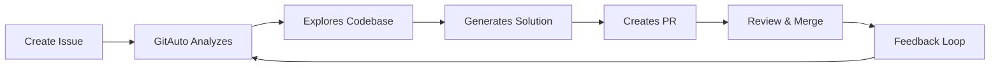

# GitAuto AI 🤖

[](https://github.com/gitautoai/gitauto/actions/workflows/pytest.yml)
[](LICENSE)
[](https://www.python.org/downloads/)

> **AI-powered GitHub coding agent that automatically creates pull requests from issue descriptions**

GitAuto is an intelligent GitHub app that transforms your backlog tickets into working code. Simply describe what you need in an issue, and GitAuto will analyze your codebase, implement the solution, and create a pull request for review.

## 🚀 Quick Start

### For Users (No Setup Required)

1. **Install GitAuto** from the [GitHub Marketplace](https://github.com/apps/gitauto-ai)
2. **Create an issue** in your repository describing what you want to build or fix
3. **Check the GitAuto checkbox** in the issue comment or add the `gitauto` label
4. **Wait for the magic** ✨ - GitAuto will create a pull request with the implementation
5. **Review and merge** the PR if it looks good

That's it! No configuration files, no complex setup - just describe what you need and let GitAuto handle the rest.

## 📖 Table of Contents

- [What is GitAuto?](#-what-is-gitauto)
- [Key Features](#-key-features)
- [How It Works](#-how-it-works)
- [Getting Started](#-getting-started)
- [Development Setup](#-development-setup)
- [Architecture](#-architecture)
- [Contributing](#-contributing)
- [Support & Community](#-support--community)
- [License](#-license)

## 🎯 What is GitAuto?

[GitAuto](https://gitauto.ai) is a GitHub coding agent designed for software engineering managers and developers who want to:

- **Accelerate development** by automating routine coding tasks
- **Focus on complex problems** while GitAuto handles the straightforward implementations
- **Maintain code quality** with AI-generated solutions that follow your project's patterns
- **Reduce backlog** by automatically implementing bug fixes and feature requests

### Perfect for:
- 🐛 **Bug fixes** - Describe the issue, get a fix
- ✨ **Feature requests** - Outline the feature, get an implementation
- 🔧 **Refactoring tasks** - Specify what needs to be improved
- 📝 **Documentation updates** - Request docs changes
- 🧪 **Test additions** - Ask for test coverage improvements

## ⭐ Key Features

- **🔍 Intelligent Code Analysis** - Understands your codebase structure and patterns
- **🎯 Context-Aware Solutions** - Generates code that fits your existing architecture
- **🔄 Iterative Improvement** - Refines solutions based on your feedback
- **📊 Multi-Language Support** - Works with Python, JavaScript, TypeScript, and more
- **🛡️ Safe & Secure** - Creates PRs for review, never pushes directly to main
- **📈 Progress Tracking** - Real-time updates on implementation progress
- **🎨 Framework Agnostic** - Supports React, Django, FastAPI, Next.js, and more

## 🔄 How It Works



1. **Issue Analysis** - GitAuto reads your issue description and understands the requirements
2. **Codebase Exploration** - Analyzes your repository structure, dependencies, and coding patterns
3. **Solution Generation** - Creates code that integrates seamlessly with your existing codebase
4. **Pull Request Creation** - Opens a PR with the implementation and detailed explanation
5. **Iterative Refinement** - Incorporates your feedback to improve the solution

## 🏁 Getting Started

### Prerequisites

- A GitHub repository (public or private)
- Issues describing what you want to build or fix

### Installation

1. **Install the GitHub App**
   - Go to [GitAuto on GitHub Marketplace](https://github.com/apps/gitauto-ai)
   - Click "Install" and select your repositories
   - Choose specific repositories or grant access to all

2. **Create Your First Issue**
   ```markdown
   ## Bug Report: Login form validation not working
   
   **Description:**
   The login form accepts empty email addresses and doesn't show validation errors.
   
   **Expected Behavior:**
   - Email field should be required
   - Show error message for invalid email formats
   - Prevent form submission with empty fields
   
   **Files to check:**
   - `src/components/LoginForm.jsx`
   - `src/utils/validation.js`
   ```

3. **Activate GitAuto**
   - Check the GitAuto checkbox in the issue comment, OR
   - Add the `gitauto` label to the issue

4. **Monitor Progress**
   - Watch the progress updates in the issue comments
   - Get notified when the PR is ready for review

### Example Use Cases

<details>
<summary>🐛 Bug Fix Example</summary>

**Issue Title:** "Fix memory leak in data processing pipeline"

**Description:**
```markdown
Our data processing pipeline has a memory leak that causes the application to crash after processing large datasets.

**Steps to reproduce:**
1. Process a dataset with >10k records
2. Monitor memory usage
3. Notice gradual memory increase without cleanup

**Expected fix:**
- Identify the source of the memory leak
- Implement proper cleanup mechanisms
- Add memory monitoring/logging
```

**GitAuto will:**
- Analyze the data processing code
- Identify memory leak sources
- Implement proper resource cleanup
- Add monitoring and logging
- Create a PR with the fix
</details>

<details>
<summary>✨ Feature Request Example</summary>

**Issue Title:** "Add dark mode toggle to user settings"

**Description:**
```markdown
Users want the ability to switch between light and dark themes.

**Requirements:**
- Toggle switch in user settings page
- Persist theme preference in localStorage
- Apply theme across all components
- Smooth transition animations

**Design notes:**
- Use existing color variables in `styles/colors.css`
- Follow the current settings page layout
```

**GitAuto will:**
- Create the theme toggle component
- Implement theme persistence
- Update existing components for dark mode
- Add smooth transitions
- Create a PR with the complete feature
</details>

## 🛠 Development Setup

Want to contribute to GitAuto or run it locally? Follow these steps:

### System Requirements

- **Python 3.12+**
- **Node.js 18+** (for frontend dependencies)
- **Git**
- **ngrok** (for webhook tunneling)

### Local Development

#### 1. Clone the Repository

```bash
git clone https://github.com/gitautoai/gitauto.git
cd gitauto
```

#### 2. Set Up Python Environment

```bash
# Create virtual environment
python3 -m venv --upgrade-deps venv

# Activate virtual environment
source venv/bin/activate  # On Windows: venv\Scripts\activate

# Verify Python setup
which python
python --version

# Install dependencies
pip install -r requirements.txt
```

#### 3. Create GitHub App for Development

1. Go to [GitHub Developer Settings](https://github.com/settings/apps)
2. Click "New GitHub App"
3. Fill in the details:
   - **App name:** `GitAuto Dev {Your Name}`
   - **Homepage URL:** `http://localhost:8000`
   - **Webhook URL:** `https://your-ngrok-url.ngrok.dev/webhook`
   - **Webhook secret:** Choose a secure secret

4. Set **Repository Permissions:**
   - Actions: Read & Write
   - Checks: Read & Write
   - Contents: Read & Write
   - Issues: Read & Write
   - Pull requests: Read & Write
   - Secrets: Read & Write

5. Subscribe to **Events:**
   - Check run, Issues, Pull requests, etc.

6. Generate and download the private key

#### 4. Set Up ngrok for Webhooks

```bash
# Create ngrok config
echo "authtoken: YOUR_NGROK_AUTH_TOKEN" > ngrok.yml
echo "version: 2" >> ngrok.yml

# Start ngrok tunnel
ngrok http --config=ngrok.yml --domain=your-domain.ngrok.dev 8000
```

#### 5. Configure Environment

1. Get the `.env` file from a team member
2. Update these values with your GitHub app details:
   ```env
   GH_APP_ID=your_app_id
   GH_APP_NAME=your_app_name
   GH_PRIVATE_KEY=your_base64_encoded_private_key
   GH_WEBHOOK_SECRET=your_webhook_secret
   ```

3. Encode your private key:
   ```bash
   base64 -i path/to/your-private-key.pem
   ```

#### 6. Run the Application

```bash
# Start the FastAPI server
uvicorn main:app --reload --port 8000 --log-level warning

# You should see:
# INFO: Uvicorn running on http://127.0.0.1:8000
# INFO: Application startup complete.
```

#### 7. Test Your Setup

1. Install your GitHub app to a test repository
2. Create an issue and activate GitAuto
3. Check the logs for webhook events
4. Verify GitAuto responds to the issue

### Development Workflow

```bash
# Keep your branch updated
git checkout your-branch
git pull origin main

# If you have uncommitted changes
git stash
git pull origin main
git stash pop

# Run tests
python -m pytest -v

# Check code quality
flake8 .
pylint services/
```

## 🏗 Architecture

GitAuto is built with a modern, scalable architecture:

### Core Components

```
├── main.py                 # FastAPI application entry point
├── config.py              # Configuration and environment variables
├── scheduler.py           # Scheduled tasks and background jobs
├── services/              # Core business logic
│   ├── anthropic/         # Claude AI integration
│   ├── github/            # GitHub API interactions
│   ├── openai/            # OpenAI API integration
│   ├── supabase/          # Database operations
│   └── webhook/           # Webhook event handling
├── utils/                 # Utility functions and helpers
└── tests/                 # Test suite
```

### Technology Stack

- **Backend:** Python 3.12, FastAPI
- **AI Models:** Claude 3.5 Sonnet, GPT-4o, O1
- **Database:** Supabase (PostgreSQL)
- **Deployment:** AWS Lambda, Docker
- **CI/CD:** GitHub Actions
- **Monitoring:** Sentry

### Key Services

- **GitHub Manager:** Handles all GitHub API interactions
- **AI Chat Services:** Manages conversations with AI models
- **Webhook Handler:** Processes GitHub events
- **File Manager:** Manages code file operations
- **Coverage Analyzer:** Tracks test coverage

## 🤝 Contributing

We welcome contributions from developers of all skill levels!

### Ways to Contribute

- 🐛 **Report bugs** - Found an issue? Let us know!
- 💡 **Suggest features** - Have ideas for improvements?
- 📝 **Improve documentation** - Help make our docs better
- 🧪 **Write tests** - Increase our test coverage
- 🔧 **Fix issues** - Pick up an issue and submit a PR

### Getting Started

1. **Fork the repository**
2. **Create a feature branch:** `git checkout -b feature/amazing-feature`
3. **Make your changes** and add tests
4. **Run the test suite:** `python -m pytest`
5. **Commit your changes:** `git commit -m 'Add amazing feature'`
6. **Push to your branch:** `git push origin feature/amazing-feature`
7. **Open a Pull Request**

### Development Guidelines

- Follow PEP 8 style guidelines
- Write tests for new functionality
- Update documentation as needed
- Use meaningful commit messages
- Keep PRs focused and atomic

### Code Quality

We use several tools to maintain code quality:

```bash
# Linting
flake8 .
pylint services/

# Testing
python -m pytest --cov=./ --cov-report=html

# Pre-commit hooks
pre-commit install
pre-commit run --all-files
```

## 📞 Support & Community

### 🔗 Quick Links

- 🌐 **Website:** [gitauto.ai](https://gitauto.ai)
- 📺 **Demo Videos:** [YouTube Channel](https://www.youtube.com/@gitauto)
- 📧 **Email:** [info@gitauto.ai](mailto:info@gitauto.ai)
- 🐦 **Twitter:** [@gitautoai](https://x.com/gitautoai)
- 💼 **LinkedIn:** [GitAuto Company](https://www.linkedin.com/company/gitauto/)

### 🆘 Getting Help

- **Issues & Bugs:** [GitHub Issues](https://github.com/gitautoai/gitauto/issues)
- **Feature Requests:** [GitHub Discussions](https://github.com/gitautoai/gitauto/discussions)
- **General Questions:** [Email us](mailto:info@gitauto.ai)

### 📚 Resources

- **Documentation:** [GitAuto Docs](https://gitauto.ai/docs)
- **Blog:** [Latest Updates](https://gitauto.ai/blog)
- **Pricing:** [Plans & Features](https://gitauto.ai/pricing)

## 📄 License

This project is licensed under the MIT License - see the [LICENSE](LICENSE) file for details.

---

<div align="center">

**Made with ❤️ by the GitAuto team**

[Website](https://gitauto.ai) • [GitHub](https://github.com/gitautoai/gitauto) • [Twitter](https://x.com/gitautoai) • [LinkedIn](https://www.linkedin.com/company/gitauto/)

</div>